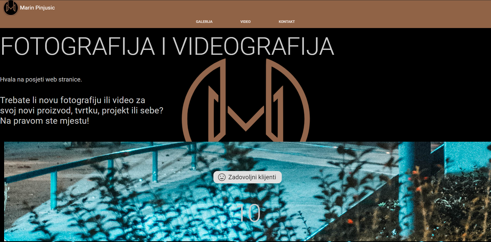
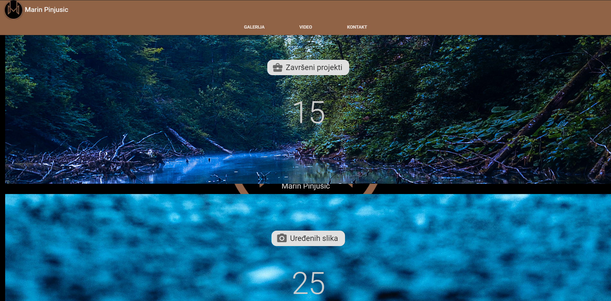
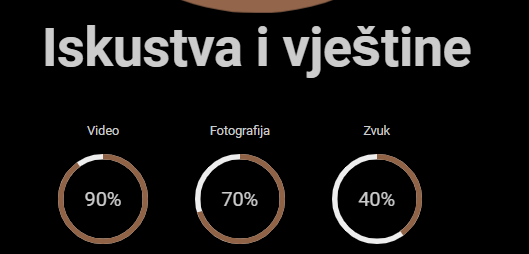
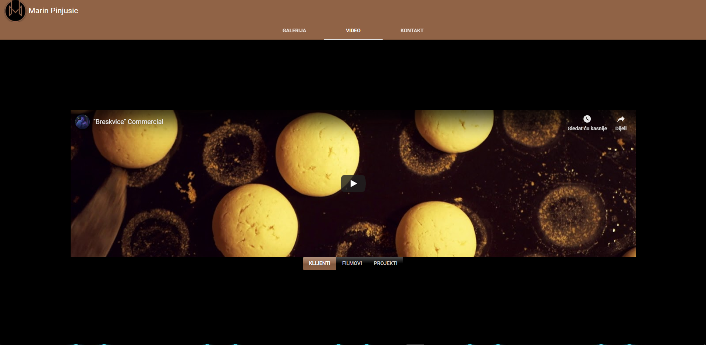
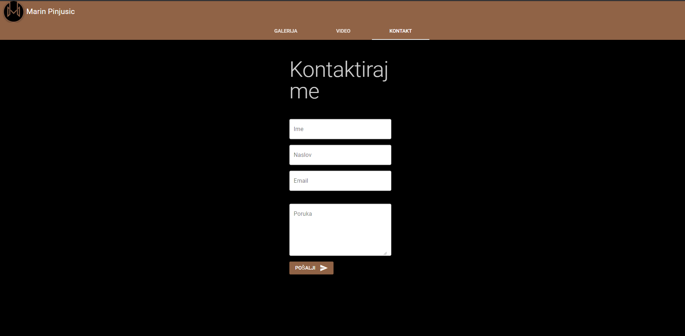
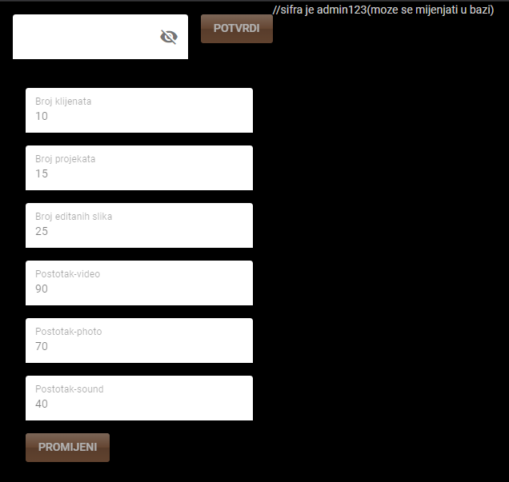
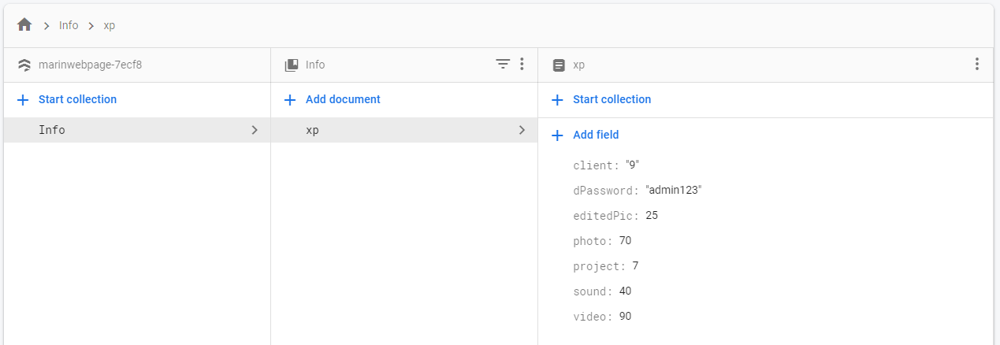

# Web page for promotional business, videographers and photographers.


My first page for viewing galleries and videos with a simple interface so interested clients can easily and quickly view pictures and videos and contact the client.

Elements such as the number of clients, projects, etc. are stored in the Firestore database. It can then be changed by accessing the administrator password page.
You can see page preview and Firestore database structure below.








## Install the dependencies
```bash
npm install
```

### Start the app in development mode (hot-code reloading, error reporting, etc.)
```bash
quasar dev
```


### Build the app for production
```bash
quasar build
```

### Customize the configuration
See [Configuring quasar.conf.js](https://quasar.dev/quasar-cli/quasar-conf-js).
